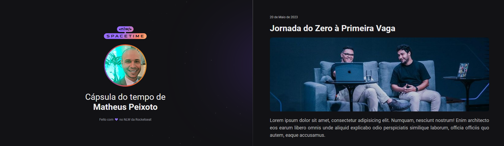

# NLW
 Apresentação NLW - Protótipo

 

## 🖥️ O Projeto
Esse é um protótipo web Responsivo de uma cápsula do tempo para exibir memórias em uma linha do tempo.
 
 

## 🚀 Tecnologias
Esse protótipo foi desenvolvido durante o NLW da Rocketseat com as seguintes tecnologias:

- HTML5
- CSS3
- Git e Github